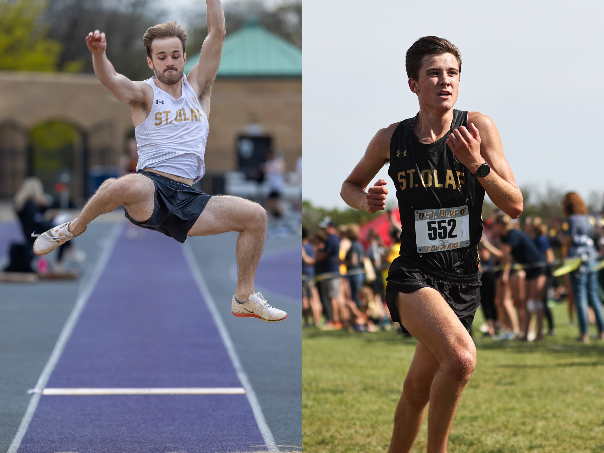

::: {style="text-align: center;"}

:::

*Over the past decade, Division III track and field has seen an explosive growth in talent and depth. From humble beginnings as an inclusive option for student-athletes prioritizing academics over elite competition, Division III track and field has increasingly become an alternative to Division I athletics. The MIAC and St. Olaf track teams have mirrored these trends. In this project, we aim to analyze the trends for within the MIAC, and across Division III as a whole. In this project, we aim to create visualizations that highlight how qualifying standards have evolved and how the overall depth of talent in the sport has grown over time.*

*For this project, we used [TFRRS](https://www.tfrrs.org/), the Track & Field Results Reporting System, for our data collection. TFRRS has been used as the database for collegiate track and field results since 2009. We plan to use it for the 23 events contested at the NCAA Outdoor Track & Field Championships and the 17 events contested at the NCAA Indoor Track & Field Championships. These events will serve as our variables, in addition to a year variable. The results from these variables will help guide us to the questions of “just how much faster, further, and higher are DIII and MIAC athletes performing?” and “How has NCAA and MIAC Championship qualifying changed?”.*

```{r setup, include=FALSE}
knitr::opts_chunk$set(echo = TRUE)
```

::: {style="text-align: center; margin-top: 30px;"}
<a href="IndoorConference.Rmd" class="btn btn-primary" style="margin: 10px;">MIAC Indoor Conference Analysis</a> <a href="OutdoorConference.Rmd" class="btn btn-primary" style="margin: 10px;">MIAC Outdoor Conference Analysis</a> <a href="Nationals.Rmd" class="btn btn-primary" style="margin: 10px;">NCAA DIII Analysis</a>
:::
