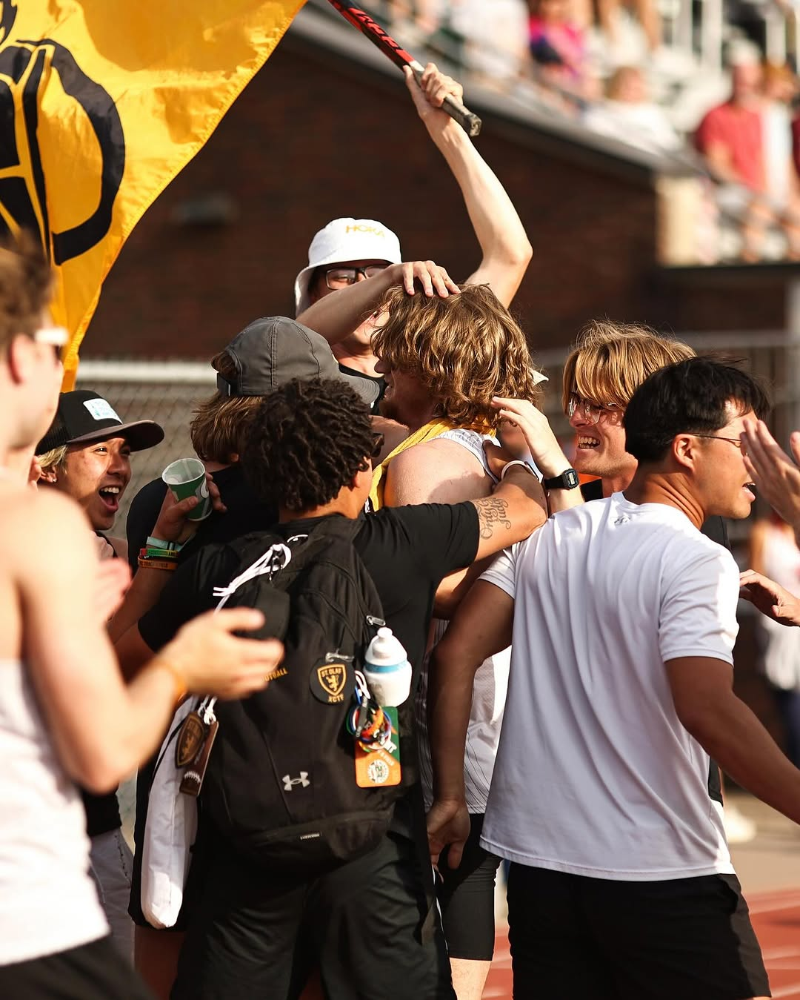

::: {style="text-align: center;"}


*[Photo Credit: Hannah Robb, St. Olaf College]*
:::

*The Minnesota Intercollegiate Athletic Conference (MIAC)is an intercollegiate athletic conference that competes in the National Collegiate Athletic Association (NCAA) Division III. All 13 of the member schools are located in Minnesota and are private institutions, with only two being non-sectarian. Since 2017, the conference has seen changes such as the departure of the University of St. Thomas and the addition of the College of St. Scholastica. The conference consistently boasts a lineup of national caliber athletes in every event. This page will explore the statistical trends of one of the premier DIII conferences in the country!*

```{r setup, include=FALSE}
knitr::opts_chunk$set(echo = TRUE)
```

## Event Display

*First is the event display. This shows the different events you can select, and the different times that earned their respective places in the MIAC. This is used to visualize a single year, and helps clear up data from the graphs below.*

```{r track-ui5, echo=FALSE}
inputPanel(
  selectInput("year5", "Select Year:", choices = sort(unique(final_miac_outdoor$Year)), selected = max(final_miac_outdoor$Year)),
  selectInput("event5", "Select Event:", choices = sort(unique(final_miac_outdoor$Event)), selected = "100 Meters (Men)"),
  sliderInput("athletes5", label = "Number of Athletes",
      min = 1, max = 50, value = 25, step = 1)
)

plotOutput("eventPlot")

output$eventPlot <- renderPlot({
  
  filtered_data <- final_miac_outdoor |>
    filter(Year == input$year5, Event == input$event5)
  
  top_n <- input$athletes5
  if (any(!is.na(filtered_data$Time))) {
    filtered_data <- filtered_data |>
      arrange(Time) |>
      head(top_n)
  } else if (any(!is.na(filtered_data$Mark))) {
    filtered_data <- filtered_data |>
      arrange(desc(Mark)) |>
      head(top_n)
  }
  
  if (all(is.na(filtered_data$Time)) && any(!is.na(filtered_data$Mark))) {
    ggplot(filtered_data, aes(x = reorder(Athlete, -Mark), y = Mark, color = Team)) +
      geom_point(size = 3) +
      labs(
           x = "Athlete", y = "Mark") +
      theme(axis.text.x = element_text(angle = 45, hjust = 1))
  } else if (any(!is.na(filtered_data$Time))) {
    ggplot(filtered_data, aes(x = reorder(Athlete, Time), y = Time, color = Team)) +
      geom_point(size = 3) +
      labs(
           x = "Athlete", y = "Time (seconds)") +
      theme(axis.text.x = element_text(angle = 45, hjust = 1))
  } else {
    plot.new()
    text(0.5, 0.5, "No valid data for selected event", cex = 1.5)
  }
})

```

## Year Comparison

*The year comparison graph is used to compare two years in any given event. This can be used to tell the strength of the depth of the conference, since it is possible to look up to 50 athletes at any given time. Simply select the two years desired, along with the event and the number of athletes depending on how deep you want to observe.*
```{r track-ui6, echo=FALSE}
inputPanel(
  selectInput("year6", "Select Year 1:", choices = sort(unique(final_miac_outdoor$Year)), selected = max(final_miac_outdoor$Year)),
  selectInput("year7", "Select Year 2:", choices = sort(unique(final_miac_outdoor$Year)), selected = max(final_miac_outdoor$Year)),
  selectInput("event7", "Select Event:", choices = sort(unique(final_miac_outdoor$Event)), selected = "100 Meters (Men)"),
  sliderInput("athletes7", label = "Number of Athletes",
      min = 1, max = 50, value = 25, step = 1)
)

plotOutput("yearComparisonPlot")

output$yearComparisonPlot <- renderPlot({

  filtered_data <- final_miac_outdoor |>
    filter((Year == input$year6 | Year == input$year7), Event == input$event7)

  top_n <- input$athletes7
  if (any(!is.na(filtered_data$Time))) {
    filtered_data <- filtered_data |>
      group_by(Year) |>
      arrange(Time, .by_group = TRUE) |>
      slice_head(n = top_n) |>
      ungroup()
  } else if (any(!is.na(filtered_data$Mark))) {
    filtered_data <- filtered_data |>
      group_by(Year) |>
      arrange(desc(Mark), .by_group = TRUE) |>
      slice_head(n = top_n) |>
      ungroup()
  }

  if (all(is.na(filtered_data$Time)) && any(!is.na(filtered_data$Mark))) {
    ggplot(filtered_data, aes(x = Place, y = Mark, color = factor(Year))) +
      geom_point(size = 3) +
      labs(
           x = "Place", y = "Mark", color = "Year") +
      theme(axis.text.x = element_text(angle = 45, hjust = 1))
    
  } else if (any(!is.na(filtered_data$Time))) {
    ggplot(filtered_data, aes(x = Place, y = Time, color = factor(Year))) +
      geom_point(size = 3) +
      labs(
           x = "Place", y = "Time (seconds)", color = "Year") +
      theme(axis.text.x = element_text(angle = 45, hjust = 1))
    
  } else {
    plot.new()
    text(0.5, 0.5, "No valid data for selected event", cex = 1.5)
  }
})


```

## Team Search

*The team search is used to see one particular team in any given event. Simply select the event you want to observe, along with the team you want to highlight. Athletes from this event that are on the selected team will be shown as gold on the scatterplot.*

```{r track-ui7, echo=FALSE}
inputPanel(
  selectInput("year8", "Select Year:", choices = sort(unique(final_miac_outdoor$Year)), selected = max(final_miac_outdoor$Year)),
  selectInput("event8", "Select Event:", choices = sort(unique(final_miac_outdoor$Event)), selected = "100 Meters (Men)"),
  sliderInput("athletes8", label = "Number of Athletes",
      min = 1, max = 50, value = 25, step = 1),
  selectInput("team8", "Select Team:", choices = sort(unique(final_miac_outdoor$Team)), selected = "St. Olaf")
)

plotOutput("teamSearchPlot")

output$teamSearchPlot <- renderPlot({
  
  filtered_data <- final_miac_outdoor |>
    filter(Year == input$year8, Event == input$event8)
  
  filtered_data <- filtered_data |>
    mutate(point_color = ifelse(Team == input$team8, "gold", "gray"))
    
  top_n <- input$athletes8
  if (any(!is.na(filtered_data$Time))) {
    filtered_data <- filtered_data |>
      arrange(Time) |>
      head(top_n)
  } else if (any(!is.na(filtered_data$Mark))) {
    filtered_data <- filtered_data |>
      arrange(desc(Mark)) |>
      head(top_n)
  }
  
  if (all(is.na(filtered_data$Time)) && any(!is.na(filtered_data$Mark))) {
    ggplot(filtered_data, aes(x = reorder(Athlete, -Mark), y = Mark)) +
      geom_point(size = 3, color = filtered_data$point_color) +
      labs(
           x = "Athlete", y = "Mark") +
      theme(axis.text.x = element_text(angle = 45, hjust = 1))
  } else if (any(!is.na(filtered_data$Time))) {
    ggplot(filtered_data, aes(x = reorder(Athlete, Time), y = Time)) +
      geom_point(size = 3, color = filtered_data$point_color) +
      labs(
           x = "Athlete", y = "Time (seconds)") +
      theme(axis.text.x = element_text(angle = 45, hjust = 1))
  } else {
    plot.new()
    text(0.5, 0.5, "No valid data for selected event", cex = 1.5)
  }
})
```

## Boxplots

*Boxplots here are used to show the IQR of any given event. This can be a great comparison of averages across years, as well as the 25th and 75th percentile. There is also jitter plot overlayed to display the athletes contributing to the plot. Simply select the event and the amount of athletes, and then is possible to display the years.*

```{r track-ui8, echo=FALSE}
inputPanel(
  selectInput("event9", "Select Event:", choices = sort(unique(final_miac_outdoor$Event)), selected = "100 Meters (Men)"),
  sliderInput("athletes9", label = "Number of Athletes",
      min = 1, max = 50, value = 25, step = 1),
  checkboxGroupInput("selected_years9", "Select Years:",
                     choices = sort(unique(final_miac_outdoor$Year)),
                     selected = sort(unique(final_miac_outdoor$Year)))
)

plotOutput("boxplot")

output$boxplot <- renderPlot({
  
  event_data <- final_miac_outdoor |>
    filter(Event == input$event9, Year %in% input$selected_years9)

  top_n <- input$athletes9

  if (all(is.na(event_data$Time)) && any(!is.na(event_data$Mark))) {
    filtered_data <- event_data |>
      filter(!is.na(Mark)) |>
      group_by(Year) |>
      arrange(desc(Mark)) |>
      slice_head(n = top_n) |>
      ungroup()
    
    ggplot(filtered_data, aes(x = factor(Year), y = Mark, fill = factor(Year))) +
      geom_boxplot(alpha = 0.6) +
      geom_jitter(width = 0.2, size = 2, alpha = 0.7) +
      labs(
           x = "Year", y = "Mark") +
      theme_minimal()

  } else if (any(!is.na(event_data$Time))) {
    filtered_data <- event_data |>
      filter(!is.na(Time)) |>
      group_by(Year) |>
      arrange(Time) |>
      slice_head(n = top_n) |>
      ungroup()
    
    ggplot(filtered_data, aes(x = factor(Year), y = Time, fill = factor(Year))) +
      geom_boxplot(alpha = 0.6) +
      geom_jitter(width = 0.2, size = 2, alpha = 0.7) +
      labs(
           x = "Year", y = "Time (seconds)") +
      theme_minimal()

  } else {
    plot.new()
    text(0.5, 0.5, "No valid data for selected event", cex = 1.5)
  }
})


```

## Conclusion

*This dashboard highlights MIAC outdoor track and field trends from 2017 to 2025, a period that has seen significant changes in the conference. Outdoor track features several events not contested indoors, such as the 100m, 10,000m, steeplechase, javelin, and more, offering a broader view of team and individual strength. While the conference experienced a dip in performance following COVID and the departure of the University of St. Thomas, the MIAC has since bounced back. Today, with deeper fields and stronger performances, the level of competition is at an all-time high.*

::: {style="text-align: center; margin-top: 30px;"}
<a href=" https://jorsheer.shinyapps.io/TFRRSAnalysis/" class="btn btn-primary" style="margin: 10px;">Home Page</a>
:::
